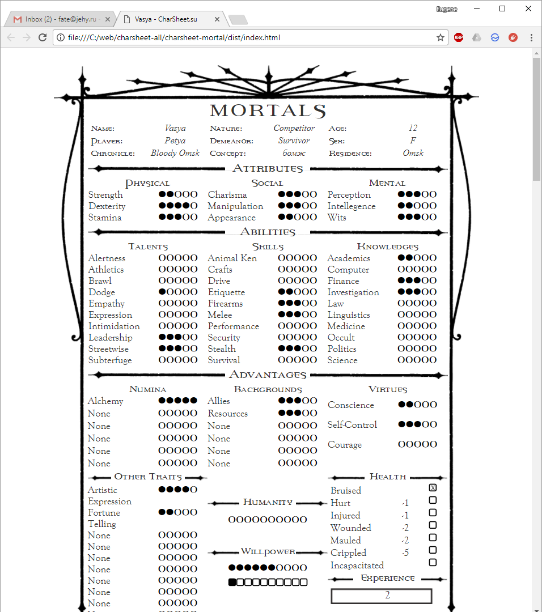

# WOD-Mortal-charsheet

[](https://travis-ci.org/jehy/WOD-Mortal-charsheet)
[](https://david-dm.org/jehy/WOD-Mortal-charsheet)
[](https://david-dm.org/jehy/WOD-Mortal-charsheet?type=dev)



It is the first character sheet, created for [Charsheet.su](http://charsheet.su).   
It is based on wonderful [Mr Gone's character sheets](http://mrgone.rocksolidshells.com/) 
 so credit for design goes to him.

## What I used for this character sheet:

- JQuery   
- Bootstrap 3   
- [X-editable](https://vitalets.github.io/x-editable/)   
- [Jquery bar rating](http://antenna.io/demo/jquery-bar-rating/examples/)

Latest version is built using Node.js and webpack. If you don`t know
Node.js, you can make your own sheet in simple HTML, CSS and JS.

Version of this sheet without node.js can be found 
[here](https://github.com/jehy/WOD-Mortal-charsheet/tree/feature/no-node).
You are free to fork this repository, make pull requests and
make new character sheets - of cause, those will be added to web site.

## Extracting useful images from pdf
If you want to use cool images and backgrounds from other character sheets, that's easy:
```bash
yum install poppler-utils
pdfimages ./some.pdf
yum install ImageMagick
convert *.ppm *.png
```

## Contents of the project:
* `/src` contains source code and css of th project
* `/dist` contains built and minified version of code (after you build it)
* `data` - folder for json files which contain data for this sheet -
 for example, list of traits, attributes or skills.
 Also contains `mock.json` - mock sheet data for testing.
* `fonts`, `img` - self described folders.


Contents of `/src`:
* `css`
  * `custom` - CSS files for this character sheet.
    * `charlist.css` - global css.
    * `dots.css` - css for displaying dots. Suddenly, yeah?
    * `list1.css`, `list2.css`, etc - css, grouped by the number of the list.
    * `print.css` - special styles for printing - hide elements, make font smaller, etc.
* `js` - different javascript.
  * `images.js` - used for handling images - uploading, removing.
  * `jquery.barrating.js` - JQuery bar rating, modified for printing.
  * `index.js` - combines all js above.
  
Of cause, for saving and loading your character sheet data you will need
 to publish your repository on [Charsheet.su](http://charsheet.su)
and use it's api - but you will be able to develop without it.

## Getting started:

1. Clone \ Fork this project
2. Run `npm install` to install all dependencies
3. Run `npm run build-dev` to build JS and CSS
4. Open `index.html` browser (it will use mocked sheet data)
5. Edit any HTML, JS and CSS from `/src`!
6. Please send me new versions :)

## Code quality

Please use ESLint with configuration in `.eslintrc.json`.

## FAQ:    

Q: Why do you use images instead of backgrounds?   
A: Because otherwise browsers don't allow to print background.   
